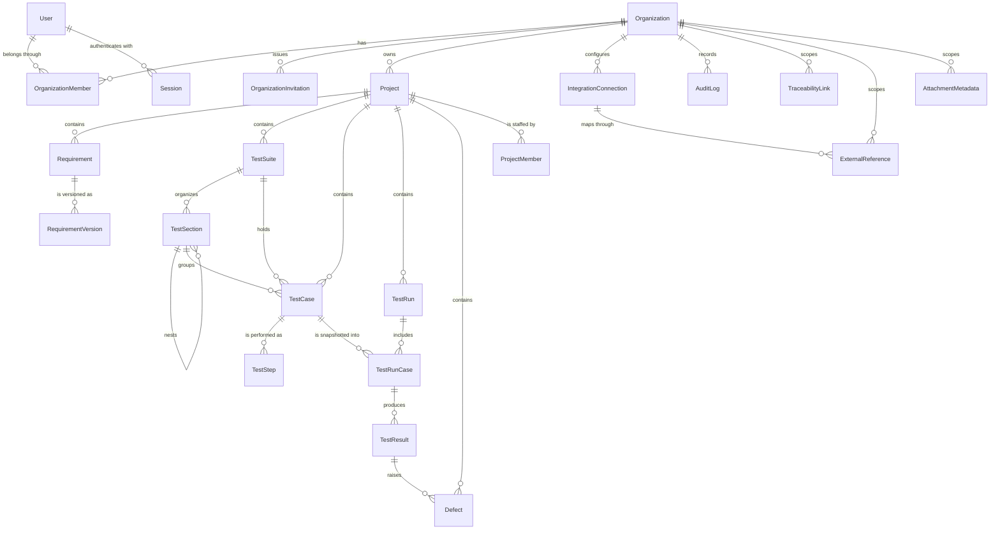
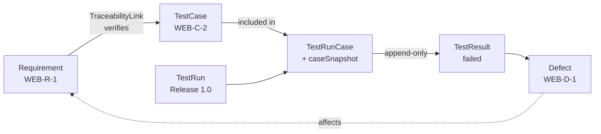

# Database diagram

Generated by hand from [`apps/api/prisma/schema.prisma`](../apps/api/prisma/schema.prisma).
If the two disagree, the schema is right and this file is a bug.

## Overview



`TraceabilityLink`, `ExternalReference` and `AttachmentMetadata` are drawn only
against `Organization` because they are **polymorphic**: they reference other
entities through `(entityType, entityId)` rather than through foreign keys. That
is a deliberate trade, explained in [`domain-model.md`](domain-model.md).

## The execution chain

The part of the model the product exists for:



Read it twice. Left to right it is "what we planned to verify, and what
happened". Right to left it is the question that sells the product: *this defect
is open — which requirement is at risk?*

## Tenancy

Every table below the identity layer carries `organizationId`, including the
ones that could derive it:

```
users                        (global — a person can belong to several organizations)
sessions                     → user
organizations
  ├── organization_members            organizationId
  ├── organization_invitations        organizationId
  ├── projects                        organizationId
  │     ├── requirements              organizationId  (+ projectId)
  │     ├── test_suites               organizationId  (+ projectId)
  │     │     └── test_sections       organizationId  (+ suiteId, parentId)
  │     ├── test_cases                organizationId  (+ projectId, suiteId, sectionId)
  │     │     └── test_steps          organizationId  (+ testCaseId)
  │     ├── test_runs                 organizationId  (+ projectId)
  │     │     └── test_run_cases      organizationId  (+ testRunId, testCaseId)
  │     │           └── test_results  organizationId  (+ testRunCaseId)
  │     └── defects                   organizationId  (+ projectId)
  ├── traceability_links              organizationId
  ├── attachment_metadata             organizationId
  ├── external_references             organizationId
  ├── integration_connections         organizationId
  └── audit_logs                      organizationId (nullable: login has no organization yet)
```

`User` is intentionally global. A person has one account and joins several
organizations, which is why `OrganizationMember` exists as a separate entity
carrying the role.

## Regenerating this diagram

There is no generator wired up; the diagram is maintained by hand so that it
stays readable and grouped by meaning rather than by table order. To inspect the
real structure:

```bash
docker compose exec postgres psql -U qaflow -d qa_flow_hub -c '\d+ test_run_cases'
npx prisma studio --schema apps/api/prisma/schema.prisma
```
